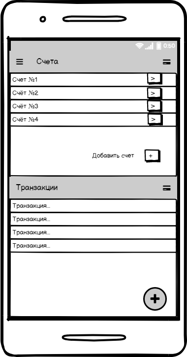
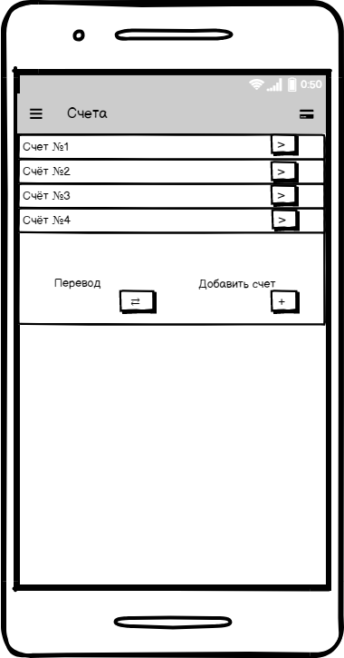
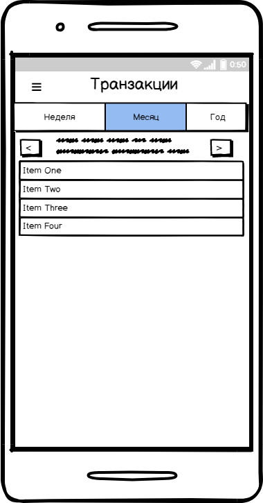
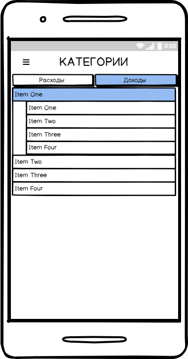
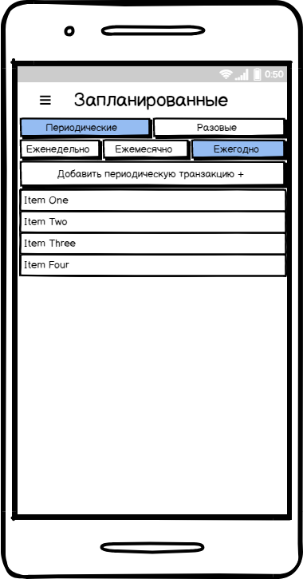
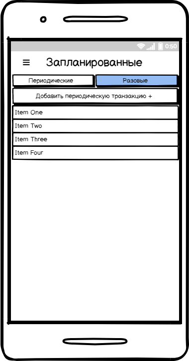
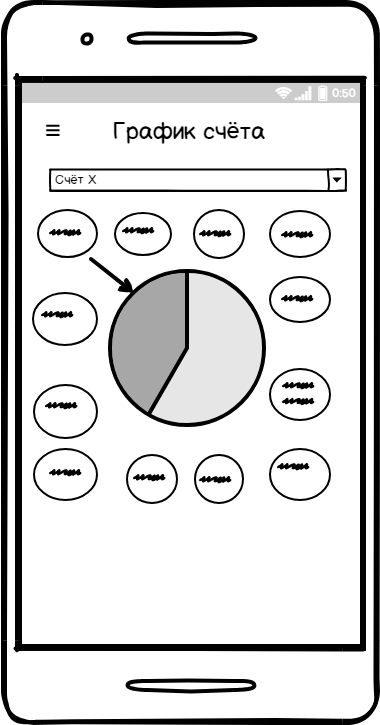

# Требования к проекту

---

# Содержание
1 [Введение](#intro)  
1.1 [Назначение](#appointment)  
1.2 [Бизнес-требования](#business_requirements)  
1.2.1 [Исходные данные](#initial_data)  
1.2.2 [Возможности бизнеса](#business_opportunities)  
1.3 [Аналоги](#analogues)  
2 [Требования пользователя](#user_requirements)   
2.1 [Интерфейс пользователя](#user_interface)  
2.2 [Характеристики пользователей](#user_specifications)  
2.2.1 [Аудитория приложения](#application_audience)   
2.3 [Предположения и зависимости](#assumptions_and_dependencies)  
3 [Системные требования](#system_requirements)  
3.1 [Функциональные требования](#functional_requirements)  
3.1.1 [Основные функции](#main_functions)   
3.1.1.1 [Главный экран](#main)  
3.1.1.2 [Счета](#bills_function)  
3.1.1.3 [Транзакции](#transaction_function)  
3.1.1.4 [Периодические транзакции](#period_transaction_function)  
3.1.1.5 [Разовые транзакции](#oneTime_transaction_function)  
3.1.1.6 [Графики](#chart_function)   
3.2 [Нефункциональные требования](#non-functional_requirements)  
3.2.1 [Атрибуты качества](#quality_attributes)  
3.2.1.1 [Требования к удобству использования](#requirements_for_ease_of_use)   
3.2.2 [Ограничения](#restrictions)  

<a name="intro"/>

# 1 Введение

<a name="appointment"/>

## 1.1 Назначение

**Money Manager** - это приложение, которое поможет *Вам* контролировать *Ваши* финансы, и *Вы* всегда будете знать, в каком состоянии *Ваши* счета.

<a name="business_requirements"/>

## 1.2 Бизнес-требования

<a name="initial_data"/>

### 1.2.1 Исходные данные

В наше время деньги играют большую роль в нашей жизни. И тот кто может управлять своими финансами грамотно и быстро побеждает в гонке за лаврами. А новейшие технологии помогают нам контролировать свои счета и вести подотчётность наших финансов в реальном времени. 

<a name="business_opportunities"/>

### 1.2.2 Возможности бизнеса

Одно дело, когда ты знаешь, как правильно распоряжаться своими сбережениями и как правильно планировать свой бюджет на день, месяц, год. Но для более детальной и развёрнутой работы с финансами нужно программное обеспечение, которое упростит работу. И тогда на помощь приходит наше приложение  **Money Manager**, которое может решить все эти задачи.

<a name="project_boundary"/>

<a name="analogues"/>

## 1.3 Аналоги
[Paymaster](https://play.google.com/store/apps/details?id=su.azure.paymaster) - мобильное приложение, которое позволяет контролировать личный бюджет, вести счета и учитывать транзакции в разных валютах и многое другое.

[Денежный менеджер, Отслеживание расходов](https://play.google.com/store/apps/details?id=money.expense.budget.wallet.manager.track.finance.tracker) - мобильное приложение, имеющее схожий набор функций и возможностей, что и Paymaster.

Все приложения, которые связаны с финансами схожи в наборе их возможностей и функциях. Однако **Money Manager** будет отличаться своей простым и понятным интерфейсом, что важно для человека, которые будет использовать его.

<a name="user_requirements"/>

# 2 Требования пользователя

<a name="user_interface"/>

## 2.1 Интерфейс пользователя  
* Cтартовый экран

 

---

* Меню приложения 

 

---

* Пользовательские счета 

 

---

* Пользовательские транзакции 

 

---

* Просмотр и настройка категорий расходов и доходов 

 

---

* Просмотр и установка периодических и разовых транзакций

 

---

* Просмотр графиков расходов и доходов

 

## 2.2 Характеристики пользователей

<a name="user_classes"/>

### 2.2.1 Аудитория приложения

Целевой аудиторией приложения являются в первую очередь люди, которые хотят улучшить свое финансовое положение, изучив свои потребности и возможности. 
<a name="assumptions_and_dependencies"/>

## 2.3 Предположения и зависимости
Данная версия приложения работает только на мобильном устройстве на операционной системой android.

<a name="system_requirements"/>

# 3 Системные требования

<a name="functional_requirements"/>

## 3.1 Функциональные требования

<a name="main_functions"/>

### 3.1.1 Основные функции

<a name="main"/>

#### 3.1.1.1 Главный экран 

**Описание.** Пользователь должен иметь выбор того, что он хочет сделать: работа с транзакциями или счетами.

| Функция | Требования | 
|:---|:---|
| Новая транзакция | Переход к окну добавления новой транзакции |
| Новый счет | Переход к окну добавления нового счета |
| Редактирование счета | Переход к окну счета |

<a name="bills_function"/>

#### 3.1.1.2 Счета

**Описание.** Пользователь должен иметь возможность сделать перевод с одного счета на другой, добавить новый счет, редактировать уже имеющийся счет.

| Функция | Требования | 
|:---|:---|
| Перевод | Переход к окну перевода средств |
| Новый счет | Переход к окну добавления нового счета |
| Редактирование счета | Переход к окну счета |

<a name="transaction_function"/>

#### 3.1.1.3 Транзакции

**Описание.** Пользователь должен иметь возможность просмотреть все транзакции за определенный период времени(неделя/месяц/год)

| Функция | Требования | 
|:---|:---|
| Просмотр транзакций за неделю | Возможность выбора нужной недели |
|  Просмотр транзакций за месяц | Возможность выбора нужного месяца |
|  Просмотр транзакций за год | Возможность выбора нужного года |

<a name="period_transaction_function"/>

#### 3.1.1.4 Периодические транзакции

**Описание.** Пользователь должен иметь возможность просмотреть периодические транзакции, а так же добавление периодических транзакций, и переход к разовым транзакциям.

| Функция | Требования | 
|:---|:---|
| Просмотр еженедельных транзакций | Отображение еженедельных транзакций |
| Просмотр ежемесячных транзакций | Отображение ежемесячных транзакций |
| Просмотр ежегодных транзакций | Отображение ежегодных транзакций |
| Добавление периодической транзакций | Переход к окну добавление периодической транзакции |
| Переход к разовым транзакциям| Возможность перехода к разовым транзакциям |

<a name="oneTime_transaction_function"/>

#### 3.1.1.5 Разовые транзакции

**Описание.** Пользователь должен иметь возможность просмотреть разовые транзакции, а так же добавить новую разовую транзакцию, и перейти к периодическим транзакциям.

| Функция | Требования | 
|:---|:---|
| Просмотр разовых транзакций | Отображение разовых транзакций |
| Добавление разовой транзакций | Возможность перехода к окну добавление периодической транзакции |
| Переход к периодическим транзакциям| Возможность перехода к периодическим транзакциям |

<a name="chart_function"/>

#### 3.1.1.6 Графики

**Описание.** Пользователь должен иметь возможность просмотреть в графическом представлении суммы расходов и доходов по определенному счету.

| Функция | Требования | 
|:---|:---|
| Выбор счета | Возможность выбора счета, который будет графически представлен в окне |
| Выбор показа доходов/расходов | Показ графического представления выбранного варианта |

<a name="categ_function"/>

#### 3.1.1.6 Категории

**Описание.** Пользователь должен иметь возможность просмотра всех возможных категорий доходов и расходов, добавление категории.

| Функция | Требования | 
|:---|:---|
| Просмотр категорий расходов | Возможность просмотра категорий расходов |
| Просмотр категорий доходов | Возможность просмотра категорий доходов |
| Новая категория | Возможность добавить новую категорию |

<a name="non-functional_requirements"/>

## 3.2 Нефункциональные требования

<a name="quality_attributes"/>

### 3.2.1 Атрибуты качества

<a name="requirements_for_ease_of_use"/>

#### 3.2.1.1 Требования к удобству использования

1. Крупные элементы управления
2. Проверка корректного ввода данных.

<a name="restrictions"/>

### 3.2.2 Ограничения
 1. Приложение работает на операционной системе android

