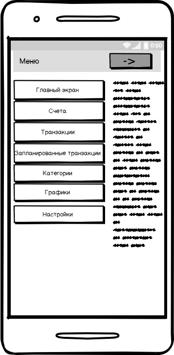

# Требования к проекту

---

# Содержание
1 [Введение](#intro)  
1.1 [Назначение](#appointment)  
1.2 [Бизнес-требования](#business_requirements)  
1.2.1 [Исходные данные](#initial_data)  
1.2.2 [Возможности бизнеса](#business_opportunities)  
1.2.3 [Границы проекта](#project_boundary)  
1.3 [Аналоги](#analogues)  
2 [Требования пользователя](#user_requirements)   
2.1 [Интерфейс пользователя](#user_interface)  
2.2 [Характеристики пользователей](#user_specifications)  
2.2.1 [Аудитория приложения](#application_audience)   
2.3 [Предположения и зависимости](#assumptions_and_dependencies)  
3 [Системные требования](#system_requirements)  
3.1 [Функциональные требования](#functional_requirements)  
3.1.1 [Основные функции](#main_functions)   

<a name="intro"/>

# 1 Введение

<a name="appointment"/>

## 1.1 Назначение

**Money Manager** - это приложение, которое поможет *Вам* контролировать *Ваши* финансы, и *Вы* всегда будете знать, в каком состоянии *Ваши* счета.

<a name="business_requirements"/>

## 1.2 Бизнес-требования

<a name="initial_data"/>

### 1.2.1 Исходные данные

В наше время деньги играют большую роль в нашей жизни. И тот кто может управлять своими финансами грамотно и быстро побеждает в гонке за лаврами. А новейшие технологии помогают нам контролировать свои счета и вести подотчётность наших финансов в реальном времени. 

<a name="business_opportunities"/>

### 1.2.2 Возможности бизнеса

Одно дело, когда ты знаешь, как правильно распоряжаться своими сбережениями и как правильно планировать свой бюджет на день, месяц, год. Но для более детальной и развёрнутой работы с финансами нужно программное обеспечение, которое упростит работу. И тогда на помощь приходит наше приложение  **Money Manager**, которое может решить все эти задачи.

<a name="project_boundary"/>

### 1.2.3 Границы проекта
"Boardgame Master" позволяет выбрать игру из списка, добавлять и удалять игроков и их персонажей, а так же редактировать информацию о них, генерировать случайные числа в заданном диапазоне, сохранять и загружать прогресс текущей игровой сессии.

<a name="analogues"/>

## 1.3 Аналоги
[Paymaster](https://play.google.com/store/apps/details?id=su.azure.paymaster) - мобильное приложение, которое позволяет контролировать личный бюджет, вести счета и учитывать транзакции в разных валютах и многое другое.

[Денежный менеджер, Отслеживание расходов](https://play.google.com/store/apps/details?id=money.expense.budget.wallet.manager.track.finance.tracker) - мобильное приложение, имеющее схожий набор функций и возможностей, что и Paymaster.

Все приложения, которые связаны с финансами схожи в наборе их возможностей и функциях. Однако **Money Manager** будет отличаться своей простым и понятным интерфейсом, что важно для человека, которые будет использовать его.

# 2 Требования пользователя

<a name="user_interface"/>

## 2.1 Интерфейс пользователя  
* Cтартовый экран

 

---

* Меню приложения 

 

---

* Пользовательские счета 

 

---

* Пользовательские транзакции 

 

---

* Просмотр и настройка категорий расходов и доходов 

 

---

* Просмотр и установка периодических и разовых транзакций

 

---

* Просмотр графиков расходов и доходов

 

## 2.2 Характеристики пользователей

<a name="user_classes"/>

### 2.2.1 Аудитория приложения

Целевой аудиторией приложения являются в первую очередь люди, которые хотят улучшить свое финансовое положение, изучив свои потребности и возможности. 
<a name="assumptions_and_dependencies"/>

## 2.3 Предположения и зависимости
Данная версия приложения работает только на мобильном устройстве под операционной системой android.

<a name="system_requirements"/>

# 3 Системные требования

<a name="functional_requirements"/>

## 3.1 Функциональные требования

<a name="main_functions"/>

### 3.1.1 Основные функции

<a name="game_choosing"/>

