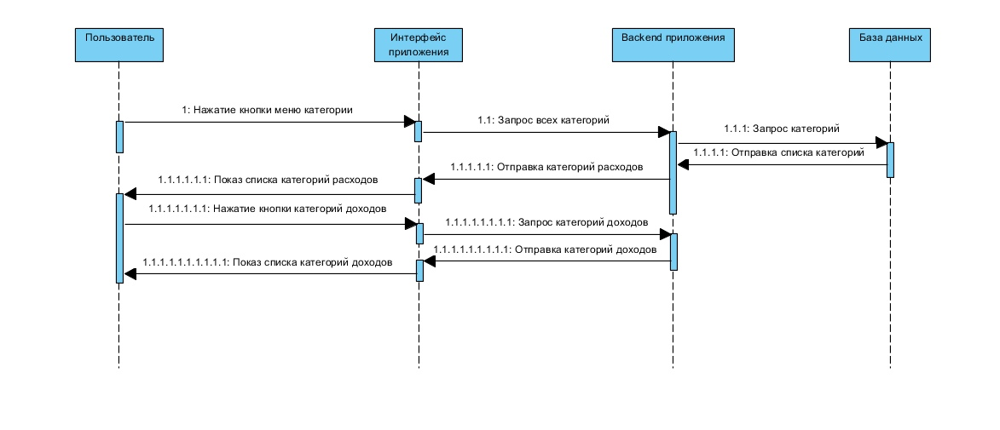

### Содержание

1.  [Ввод данных](#enter_data)
2.  [Редактирование данных](#update_data)
3.  [Удаление счёта](#delete_bill)
4.  [Показ всех транзакций](#show_transaction)
5. [Показ графиков](#show_graph)
6. [Показ всех категорий](#show_categories)

<a name="enter_data"/>

## 1. Ввод данных

 

<a name="update_data"/>

## 2. Редактирование данных

 

<a name="delete_bill"/>

## 3. Удаление счёта

 

<a name="show_transaction"/>

## 4. Показ всех транзакций

<a name="show_graph"/>

## 5. Показ графиков

 

<a name="show_categories"/>

## 6. Показ всех категорий

 