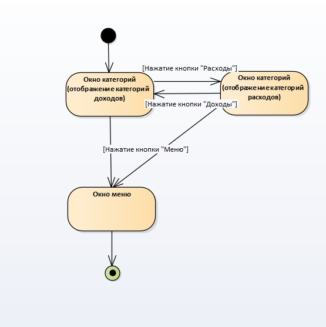

# **Диаграммы состояний**

### Содержание 

1 [Окно счета](#Account)  
2 [Окно отображения категорий](#Categories)  
3 [Окно периодических транзакций](#PeriodTransaction)  
4 [Главное окно](#Main)  
5 [Меню](#Menu)  
6 [Окно транзакций](#Transaction)  

## 1 Окно счета

<a name="Account"/>

 

## 2 Окно отображения категорий

<a name="Categories"/>

 

## 3 Окно периодических транзакций

<a name="PeriodTransaction"/>

 

## 4 Главное окно

<a name="Main"/>

 

## 5 Меню

<a name="Menu"/>

 

## 6 Окно транзакций

<a name="Transaction"/>

 
