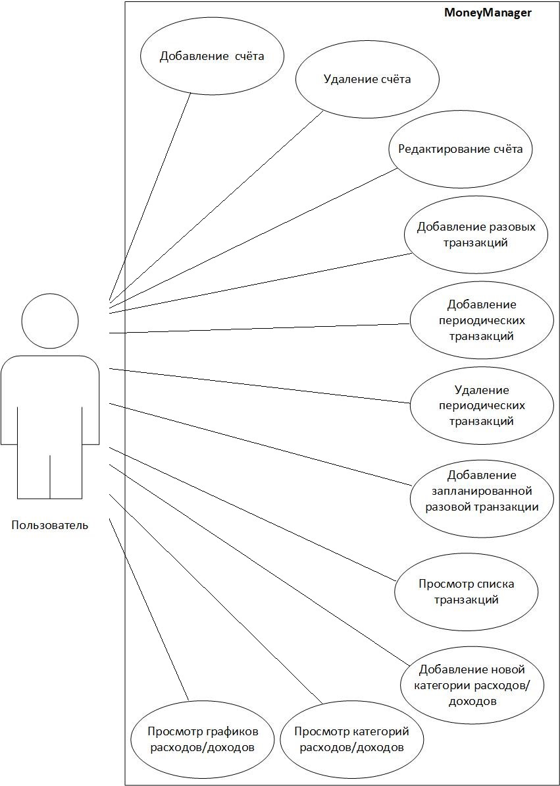

# **Содержание**
1 [Варианты использования](#use_case)  
1.1 [Актёры](#actor)  
1.2 [Варианты использования](#_use_case)  
1.2.1 [Добавление новой разовой транзакции и нового счёта](#_add_new_transaction_or)  
1.2.2 [Редактирование счёта](#update_account)   
1.2.3 [Удаление счёта](#delete_account)  
1.2.4 [Добавление новой периодической транзакции](#add_period_transaction)  
1.2.5 [Добавление новой разовой транзакции](#add_new_oneTime_transaction)  
1.2.6 [Просмотр списка транзакций](#list_of_transaction)     
1.2.7 [Просмотр графиков расходов/доходов](#show_chart)     
1.2.8 [Просмотр категорий расходов/доходов](#show_categories)    
1.2.9 [Добавление новой категорий расходов/доходов](#add_categories)   

<a name="use_case"/>

# 1 **Варианты использования**

 

<a name="actor"/>

## 1.1 **Актёры**

| Актёр | Описание | 
|:---|:---|
| Пользователь | Человек, использующий данное приложение |

<a name="_use_case"/>

## 1.2 **Варианты использования**

<a name="_add_new_transaction_or"/>

### 1.2.1 **Добавление новой разовой транзакции и нового счёта**

**Описание**: Добавление новой транзакции на определённом счёте. А так же добавление нового счёта.

**Предпосылка**: Пользователь нажал кнопку добавления новой транзакции на главном экране. Или пользователь нажал кнопку добавления счёта.

**Основной поток.**

1. Приложение переходит к окну добавления информации о транзакции/счёте
2. Пользователь производит заполнение полей новой транзакции/нового счёта
3. Пользователь нажимает кнопку подтверждения транзакции/ добавления нового счёта или же нажимает кнопку отмены транзакции/добавления нового счёта, в случае чего происходит переход к альтернативному потоку А1.
4. Запись новой транзакции/нового счёта в память приложения.
5. Переход к главному экрану приложения.
6. Вариант использования завершается.

**Альтернативный поток А1.**

1. Переход к главному экрану приложения.
2. Вариант использования завершается.

<a name="update_account"/>

### 1.2.2 **Редактирование счёта**

**Описание:** Изменение информации выбранного счёта.

**Предпосылка:** Пользователь нажал кнопку редактирования счёта на главном экране или же в разделе Счета.

**Основной поток.**

1. Приложение переходит к окну редактирования счёта.
2. Пользователь производит изменения информации о счёте. 
3. Пользователь нажимает кнопку подтверждения. Иначе происходит переход к альтернативному потоку А1.
4. Происходит перезапись информации в приложении о счёте и его транзакциях.
5. Переход к предыдущему окну.
6. Вариант использования завершается.

**Альтернативный поток А1.**

1. Переход к предыдущему окну.
2. Вариант использования завершается.

<a name="delete_account"/>

### 1.2.3 **Удаление счёта**

**Описание:**Удаление выбранного счёта.
Предпосылка: Пользователь нажал кнопку удаления счёта на главном экране или же в разделе Счета.

**Основной поток.**

1. Приложение делает повторный запрос информации у пользователя о корректности выбора операции удаления.
2. Если пользователь подтверждает действие нажав на кнопку подтверждения, то производится удаление всей информации о счёте. Иначе происходит переход к альтернативному потоку А1.
3. Переход к предыдущему окну.
4. Вариант использования завершается.

**Альтернативный поток А1.**

1. Переход к предыдущему окну.
2. Вариант использования завершается.

<a name="add_period_transaction"/>

### 1.2.4 **Добавление новой периодической транзакции**

**Описание:** Добавление транзакции, которая будет автоматически произведена с определённым интервалом по времени.

**Предпосылка:** Пользователь нажал кнопку добавления новой периодической транзакции в разделе Запланированные транзакции.

**Основной поток.**
1. Переход к окну редактирования периодической транзакции.
2. Ввод данных пользователем.
3. Проверка на корректность введённых данных. Если пользователь ввёл некоректные данные переход к альтернативному потоку А1.
4. Пользователь нажимает кнопку подтверждения. Иначе нажимает кнопку отмены ввода информации и происходит переход к пункту 6.
4. Запись информации в память приложения.
5. Переход к предыдущему окну.
6. Вариант использования завершается.

**Альтернативный поток А1.**

1. Вывод информации о некоректном вводе данных.
2. Повторный запрос ввода данных.
3. Переход к пункту 2 основного потока.

<a name="add_new_oneTime_transaction"/>

### 1.2.5 **Добавление новой разовой транзакции**

**Описание:** Добавление транзакции, которая будет автоматически произведена в указанное время.

**Предпосылка:** Пользователь нажал кнопку добавления новой разовой транзакции в разделе Запланированные транзакции.

**Основной поток.**
1. Переход к окну редактирования разовой транзакции.
2. Ввод данных пользователем.
3. Проверка на корректность введённых данных. Если пользователь ввёл некоректные данные переход к альтернативному потоку А1.
4. Пользователь нажимает кнопку подтверждения. Иначе нажимает кнопку отмены ввода информации и происходит переход к пункту 6.
4. Запись информации в память приложения.
5. Переход к предыдущему окну.
6. Вариант использования завершается.

**Альтернативный поток А1.**

1. Вывод информации о некоректном вводе данных.
2. Повторный запрос ввода данных.
3. Переход к пункту 2 основного потока.

<a name="list_of_transaction"/>

### 1.2.6 **Просмотр списка транзакций**

**Описание:** Показ транзакций.

**Предпосылка:** Переход к разделу Транзакции.

**Основной поток.**
1. Загрузка из памяти всех транзакций проведенных на данной неделе.
2. Переход к другому разделу приложения. Иначе нажатие на кнопку "Неделя" или "Год" и переход к альтернативному потоку А1.
6. Вариант использования завершается.

**Альтернативный поток А1.**

1. Вывод списка всех транзакций за выбранный период времени.
2. Переход к другому разделу приложения. Иначе переход к пункту 1.
3. Вариант использования завершается.

<a name="show_chart"/>

### 1.2.7 **Просмотр графиков расходов/доходов**

**Описание:** Показ графического представления расходов/доходов выбранного счёта.

**Предпосылка:** Переход к разделу Графики.

**Основной поток.**
1. Графическое представление информации по первому счёту в списке.
2. Выбор другого счёта из списка.
3. Графическое представление информации по выбранному счёту.
4. Переход к другому разделу приложения. Иначе выбор другого счёта для отображения информации(переход к пункту 3 основного потока).
5. Вариант использования завершается.

<a name="show_categories"/>

### 1.2.8 **Просмотр категорий расходов/доходов**

**Описание:** Показ категорий расходов/доходов.

**Предпосылка:** Переход к разделу Категории.

**Основной поток.**
1. Представление информации в виде списка категорий расходов.
2. Выбор категории доходов. Иначе переход к пункту 4 основного потока.
3. Представление информации в виде списка категорий доходов.
4. Переход к другому разделу приложения. Иначе Выбор категории расходов.(переход к пункту 1 основного потока).
5. Вариант использования завершается.

<a name="add_categories"/>

### 1.2.9 **Добавление новой категорий расходов/доходов**

**Описание:** Добавление в древо категорий расходов/доходов новой категории.

**Предпосылка:** Нажатие на кнопку добавления новой категории в разделе Категории.

**Основной поток.**

1. Переход к окну добавления новой категории
2. Ввод пользователем полей категории.
3. Если данные не корректны, то вывод сообщения об ошибке и переход к шагу 2. Иначе шаг 4.
4. Запись в память новой категории.
5. Переход к предыдущему окну.
6. Вариант использования завершается.

